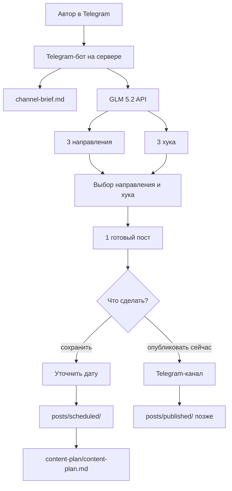
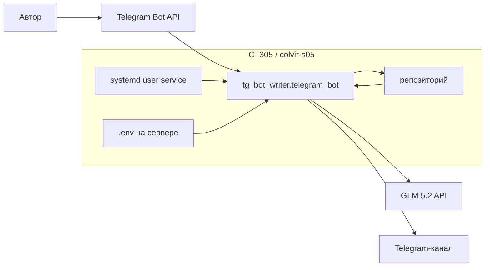
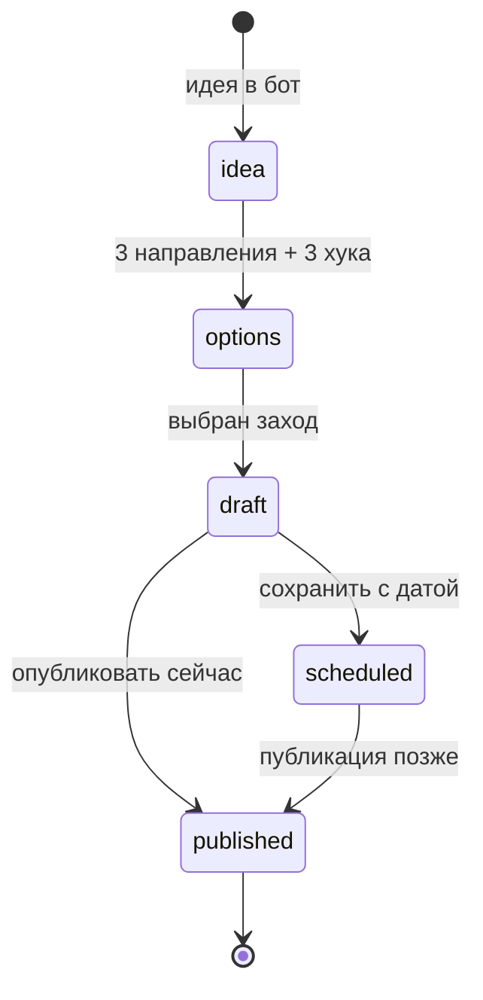

# tg-bot-writer

Контент-завод для Telegram-канала: идея превращается в направления, хуки, один готовый пост, запись в контент-план или публикацию в канал.

Сейчас реализован учебный серверный бот для этапа 2.

## Пайплайн



## Архитектура



## Жизненный цикл поста



## Структура

| Путь | Назначение |
|---|---|
| `tg_bot_writer/` | код учебного бота |
| `tests/` | unittest-тесты |
| `docs/bot-contracts.md` | контракты поведения бота |
| `.env.example` | шаблон переменных без секретов |
| `channel-brief.md` | правила канала |
| `content-plan/content-plan.md` | единый контент-план |
| `posts/drafts/` | черновики |
| `posts/scheduled/` | готовые посты с датой |
| `posts/published/` | опубликованные посты |

## Локальный запуск

```bash
cp .env.example .env
chmod 600 .env
python3 -m unittest discover -s tests
python3 -m tg_bot_writer.telegram_bot --dry-run
python3 -m tg_bot_writer.telegram_bot
```

Реальные значения кладутся только в `.env` или переменные окружения сервера.

## Переменные окружения

| Переменная | Что хранит |
|---|---|
| `TELEGRAM_BOT_TOKEN` | токен Telegram-бота |
| `TELEGRAM_CHANNEL_ID` | ID или username канала. Для числового ID канала нужен формат `-100...` |
| `GLM_API_KEY` | ключ GLM API |
| `GLM_MODEL` | модель, сейчас `glm-5.2` |
| `GLM_BASE_URL` | endpoint GLM API |

## Сервер

Учебный бот развёрнут на `CT305 / colvir-s05` под пользователем `student`.

Проверки:

```bash
ssh -p 23005 student@158.69.127.134
cd ~/tg-bot-writer
python3 -m unittest discover -s tests
python3 -m tg_bot_writer.telegram_bot --dry-run
systemctl --user status tg-bot-writer.service
```

Секреты на сервере лежат в `/home/student/tg-bot-writer/.env` с правами `600`.

## Правила

- Не коммитить `.env`, токены и ключи.
- Не публиковать в канал без явного подтверждения.
- После работы по issue: тесты, коммит с `Refs #N`, push, комментарий в issue, закрытие.
- Правила агента: [`AGENTS.md`](AGENTS.md).
