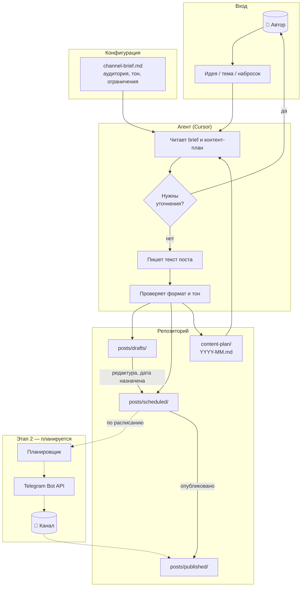
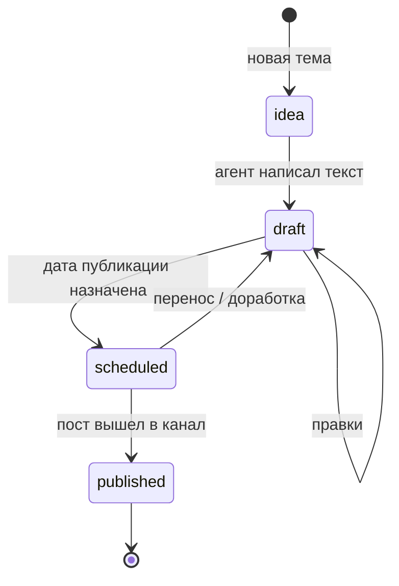
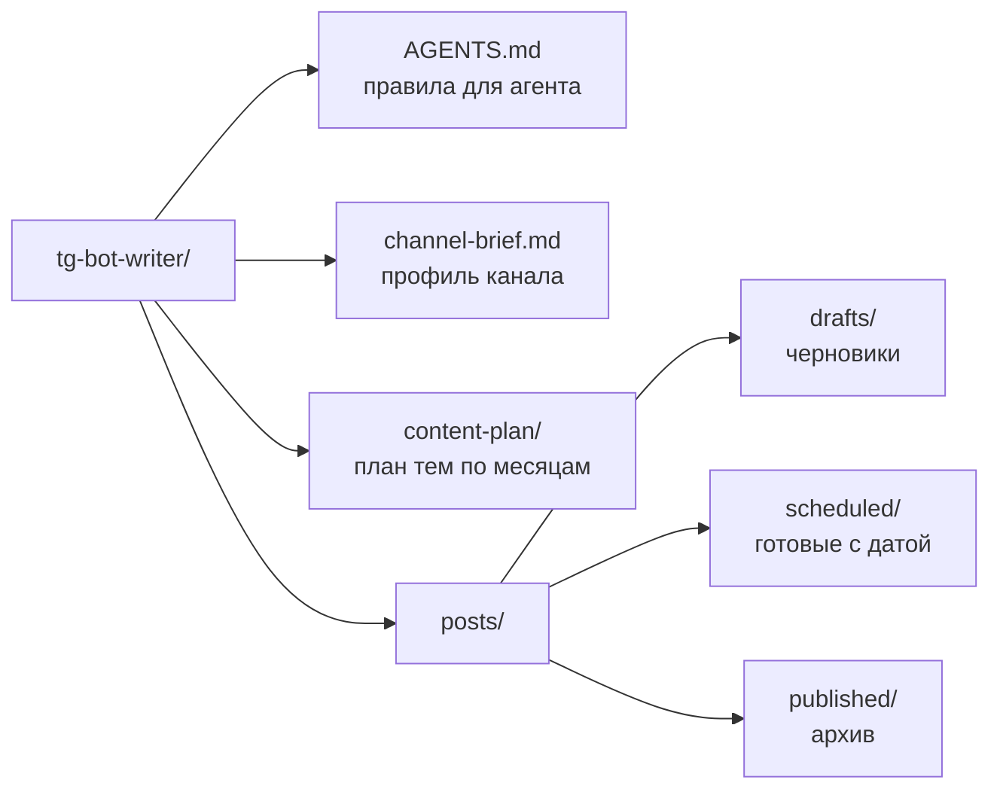

# tg-bot-writer

Контент-завод для Telegram-канала: идеи превращаются в тексты постов, складываются в репозиторий и готовятся к ежедневной публикации по расписанию.

Сейчас работает **этап 1** — тексты и контент-план. Автопубликация — следующий этап.

## Пайплайн

## Жизненный цикл поста

## Структура репозитория

## Как пользоваться

1. Заполни `channel-brief.md` — профиль канала.
2. Открой папку в Cursor и опиши идею: *«Напиши пост про … на завтра»*.
3. Агент сохранит файл в `posts/drafts/` или `posts/scheduled/` и обновит `content-plan/`.
4. Проверь превью, при необходимости попроси правки.

Правила работы агента — в [`AGENTS.md`](AGENTS.md).
